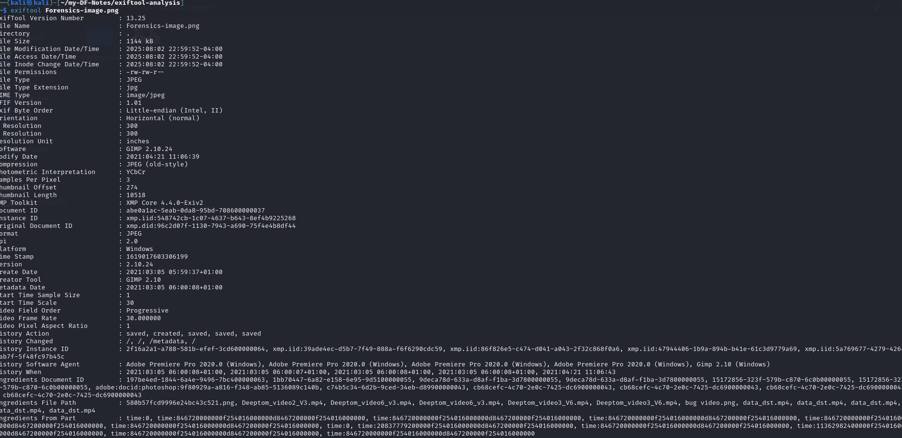
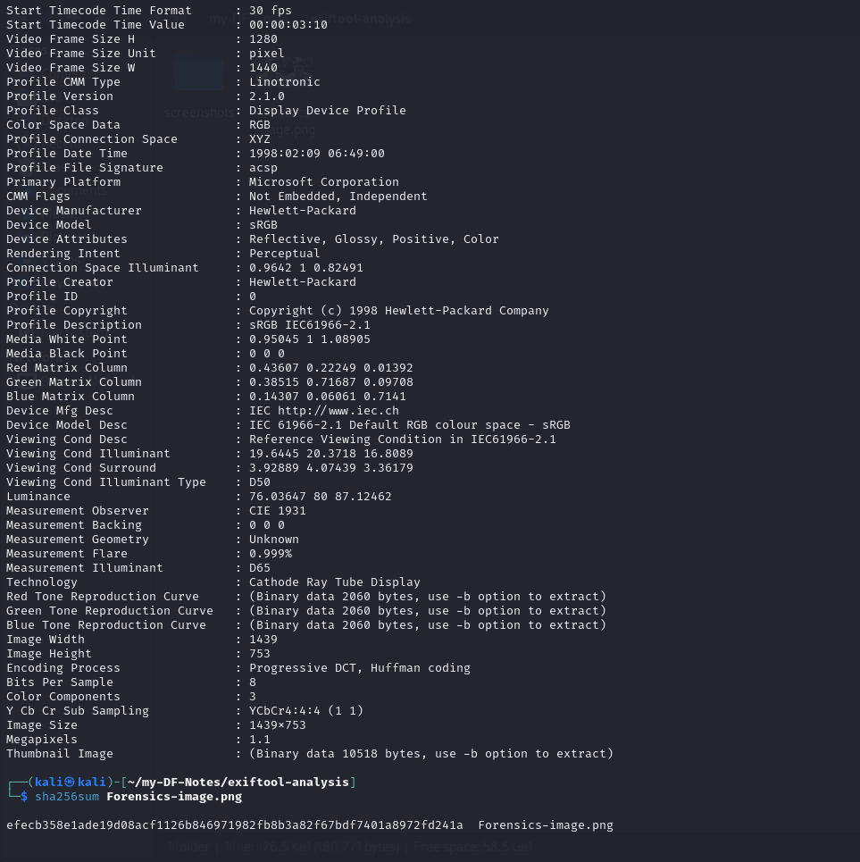

# ExifTool Metadata Analysis Report

## Image Overview
- Filename: Forensics-image.png
- File Size: 1144 kB
- Image Dimensions: 1439 x 753

## Camera Info
- Make: Not available
- Model: Not available

## Geolocation
- GPS Lat/Long: Not available
- Maps Link: Not applicable

## Timestamps
- Create Date: 2021:03:05 05:59:37+01:00
- Modify Date: 2021:04:21 11:06:39

## Software / Comments
- Software: GIMP 2.10.24
- History shows edits using:
  - Adobe Premiere Pro 2020.0 (Windows)
  - GIMP 2.10 (Windows)
- File Type: JPEG (despite filename `.png`)

## SHA256 Hash
- `efecb358e1ade19d08acf1126b846971982fb8b3a82f67bdf7401a8972fd241a`

## Inference
The file has gone through multiple edits:
- Initially created and edited in Adobe Premiere Pro and GIMP.
- Final save done in GIMP 2.10.24 on Windows.
- The filename extension is `.png`, but the actual file type is JPEG.

These metadata clearly show it is **not an original photo** from a camera; instead, it was processed and exported manually.  
No EXIF camera fields or GPS data are present.

## Screenshots

